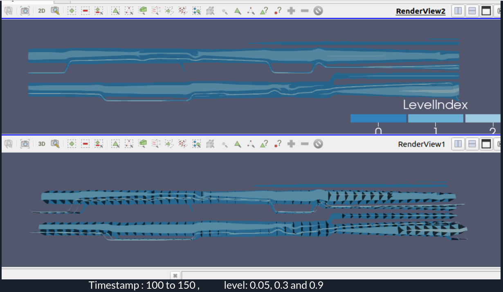
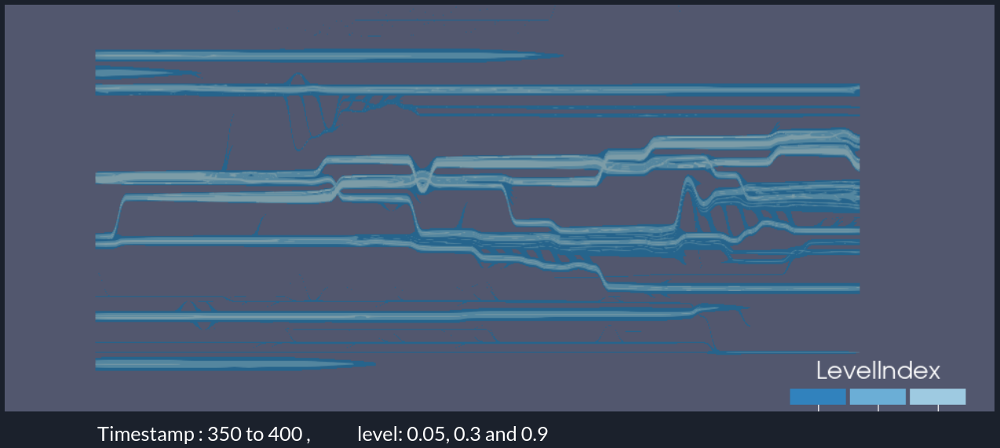

# Nested-Tracking-Graphs
## Visualization of evolution of components of time varying scalar fields with Nested Tracking Graphs.th.se/~weinkauf/notes/squarecylinder.html
<ul>
<li> We will compute the nested tracking graph for the dataset of 3D Flow Around a Confined Square Cylinder.
<li> First we will compute superlevel set components that are connected areas in the scalar field that exceed a certain threshold using 3D flood fill algorithm.
<li> Next we will compute tracking graphs for each of the selected levels. 
<li> Then we will generate the nested tracking graph from these tracking graphs using their nesting hierarchy as described in the reference paper.
</ul>

Nested tracking graphs - Visualisations for given datasets and levels
1. Timestamp : 100 to 150 ,	 level: 0.05, 0.3 and 0.9

2. Timestamp : 350 to 400 ,	 level: 0.05, 0.3 and 0.9

Reference :
 1. Jonas Lukasczyk, Gunther Weber, Ross Maciejewski, Christoph Garth, and Heike Leitte, Nested Tracking Graphs https://escholarship.org/uc/item/1b51k20d 
 2. Flood fill algorithm - https://en.wikipedia.org/wiki/Flood_fill
 3. Dataset: 3D Flow Around a Confined Square Cylinder : https://www.csc.k
 4. The Topology ToolKit (TTK) .- https://topology-tool-kit.github.io/
